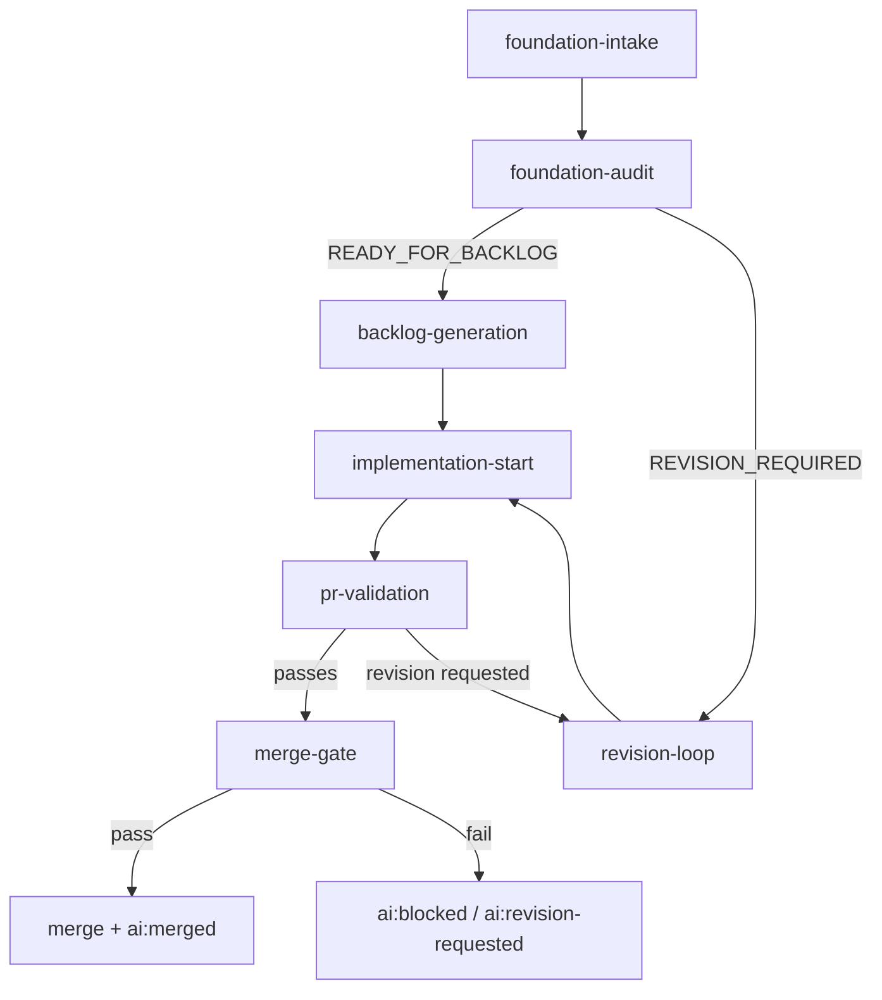

# AI-First Workflow Map

This document maps end-to-end trigger flow across the GitHub Actions scaffolding for documentation-first delivery.

## Workflow Inventory
1. `foundation-intake.yml`
2. `foundation-audit.yml`
3. `backlog-generation.yml`
4. `implementation-start.yml`
5. `pr-validation.yml`
6. `revision-loop.yml`
7. `merge-gate.yml`

## End-to-End Trigger Flow

## Trigger Model (Current Scaffold)
- All workflows use `workflow_dispatch` or minimal PR triggers as placeholders.
- Future automation can connect label-based triggers using the policy in `/docs/planning/label-policy.md`.

## Inputs/Outputs Hand-off

| From | To | Key Hand-off |
|---|---|---|
| foundation-intake | foundation-audit | task/session id + intake summary |
| foundation-audit | backlog-generation | readiness verdict + audit report |
| backlog-generation | implementation-start | task package paths + prioritized backlog |
| implementation-start | pr-validation | task id + active branch/session |
| pr-validation | merge-gate | validation/evidence report |
| revision-loop | implementation-start | revision plan + status |

## Label Transition Intent
- Intake/planning: `ai:intake` -> `ai:planning` -> `ai:foundation-ready` -> `ai:approved-for-backlog`
- Execution: `ai:task-packaged` -> `ai:ready-for-implementation` -> `ai:implementing` -> `ai:self-validating`
- Verification/merge: `ai:ready-for-verification` -> `ai:verified` -> `ai:ready-to-merge` -> `ai:merged`
- Exception states: `ai:blocked`, `ai:needs-human-decision`, `ai:revision-requested`

## Codex Integration Points
- Intake synthesis and initial artifact drafting
- Foundation audit and readiness decision support
- Backlog/task package generation
- PR evidence and policy conformance checks
- Revision planning from review feedback
- Merge-gate compliance confirmation

## Notes
- Secrets and external credentials are intentionally not wired in this scaffold.
- Workflows are templates for progressive hardening once CI/CD ownership is assigned.
