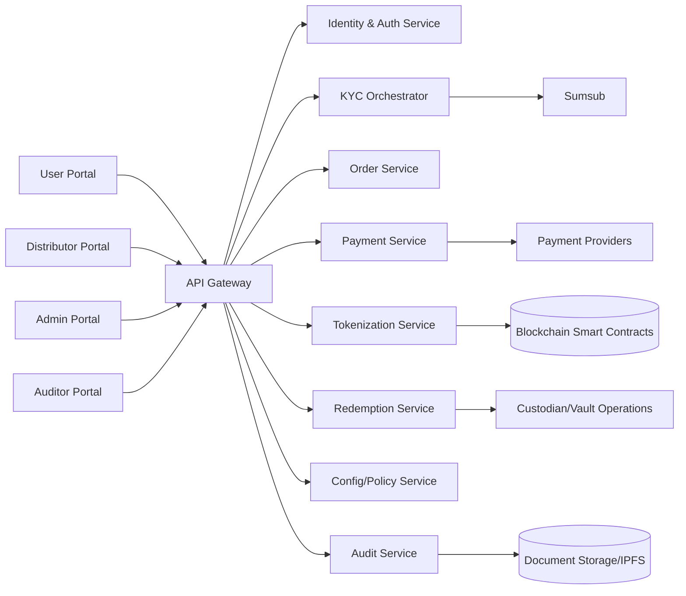
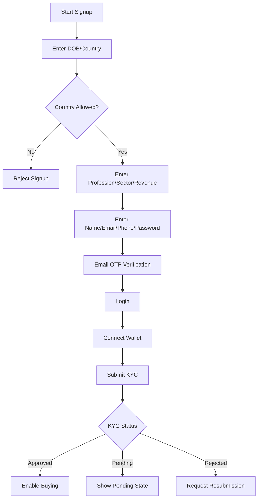
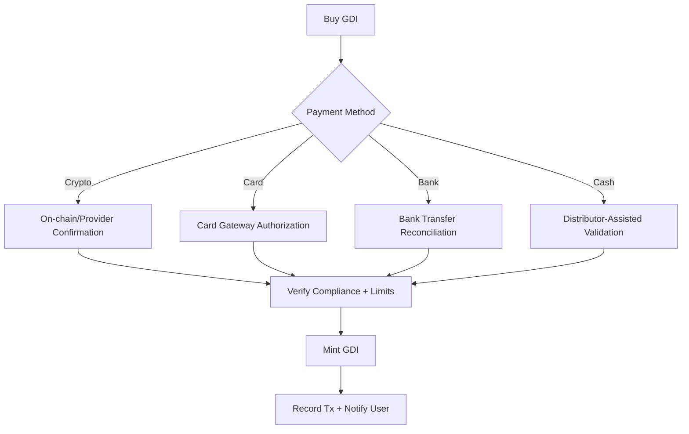
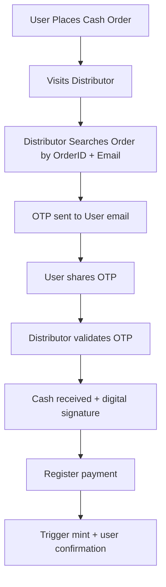
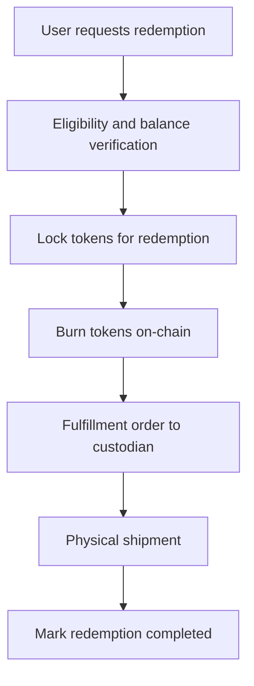
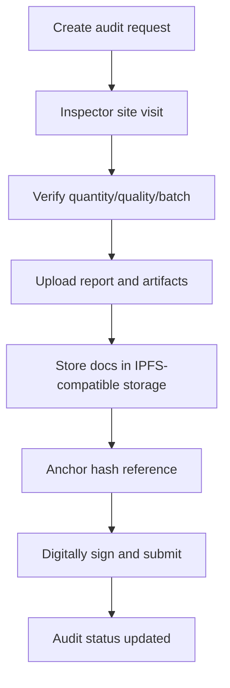

# GolDefi Platform — Software Requirements Specification (SRS)

- **Document ID:** GDF-SRS-3.0
- **Version:** 3.0 (Expanded Master SRS)
- **Date:** April 9, 2026
- **Prepared for:** GolDefi
- **Prepared by:** Product & Engineering Documentation Team
- **Status:** Draft for implementation planning

---

## 1. Revision History

| Date | Version | Author | Summary |
|---|---:|---|---|
| 2023-12-12 | 1.0 | Team | Initial SRS |
| 2023-12-24 | 1.1 | Team | Updates to registration and token purchase |
| 2024-03-11 | 1.2 | Team | KYC and workflow updates |
| 2024-04-23 | 2.0 | Team | Major requirements revision |
| 2024-06-18 | 2.1 | Team | Tokenization and redemption clarification |
| 2024-07-23 | 2.2 | Team | Final draft of earlier phase |
| 2026-04-09 | 3.0 | Team | Full-fledged SRS expansion with architecture, flow charts, wireframes, design system, branding, QA traceability |

---

## 2. Purpose, Scope, and Context

### 2.1 Purpose
This SRS defines functional and non-functional requirements for **GolDefi**, a blockchain-enabled digital-gold platform that allows compliant users to buy, hold, transfer, and redeem gold-backed tokens (GDI).

### 2.2 Business Goal
Provide a trusted digital gold ownership model where every circulating token is backed by audited physical gold under custody, with transparent lifecycle controls across minting, sale, transferability, and redemption.

### 2.3 In-Scope (Phase 1 + readiness)
- User onboarding (registration, email verification, login, MFA)
- KYC/AML orchestration and enforcement gates
- Wallet binding and update with proof of beneficial ownership
- GDI purchase via crypto/card/bank/cash (with distributor support for cash)
- Mint, transfer, and burn orchestration via smart contracts
- Distributor operations for cash order validation and settlement registration
- Audit workflows, inspector reports, and immutable evidence references
- Redemption workflow to convert tokens back to physical gold delivery
- Admin policy management (countries, fees, thresholds, payment rails)
- Multi-portal UX: user, distributor, auditor, and admin

### 2.4 Out-of-Scope (for this release train)
- Multi-vault weighted routing in production (architecture supports future enablement)
- Mobile app native clients
- Real-time hedging/treasury automation
- Secondary market trading/exchange operations
- Distributor financial settlement reconciliation automation

---

## 3. Product Vision and Success Metrics

### 3.1 Vision Statement
"Enable globally compliant, transparent, and secure fractional gold ownership through tokenized digital assets redeemable into physical delivery."

### 3.2 Success Metrics (KPIs)
- KYC completion rate: **>= 75%** of initiated applications
- Successful purchase conversion: **>= 60%** of approved users
- Payment-to-mint settlement latency (p95): **< 3 minutes**
- Redemption processing initiation (p95): **< 15 minutes** after verification
- Platform availability: **>= 99.9% monthly uptime**
- Security incidents with token loss: **0 tolerated**

---

## 4. Priorities and Delivery Sequencing

### 4.1 Priority Model
- **P0 (Must Have):** compliance, identity controls, mint/burn integrity, ledger consistency, security controls
- **P1 (Should Have):** operational tooling, audit evidence indexing, reporting, configurable policies
- **P2 (Could Have):** growth features (referrals, loyalty, campaign mechanics)

### 4.2 Priority Matrix

| Capability | Priority | Reason |
|---|---|---|
| Registration + Email OTP + Login | P0 | Identity baseline |
| KYC integration and status enforcement | P0 | Regulatory gate |
| Wallet connect + ownership verification | P0 | Asset custody integrity |
| Purchase flow (crypto/card/bank/cash) | P0 | Core monetization |
| Token mint/transfer/burn orchestration | P0 | Core platform function |
| Redemption request and processing | P0 | Asset utility promise |
| Admin policy controls | P1 | Operational agility |
| Audit workflows with document hash anchoring | P1 | Trust and verification |
| Advanced analytics dashboards | P2 | Decision support |

---

## 5. Stakeholders and User Roles

| Role | Description | Primary Goals |
|---|---|---|
| End User | Retail/institutional token buyer | Onboard, buy tokens, redeem safely |
| Distributor | Cash payment facilitator | Validate orders, register cash payments |
| Auditor / Inspector | Independent physical audit actor | Record factual findings and evidence |
| Admin / Ops | Internal platform operator | Configure policies, review exceptions |
| Compliance Officer | KYC/AML reviewer | Ensure legal and risk adherence |
| Custodian/Vault Partner | Physical gold handler | Ensure reserve availability |

---

## 6. Domain Model (Conceptual)

### 6.1 Core Entities
- **User**: identity, contact profile, KYC state, MFA state
- **WalletBinding**: linked wallet address + verification signatures
- **Order**: purchase intent + payment method + settlement status
- **TokenTransaction**: mint/transfer/burn event references
- **GoldReserveBatch**: physical lot metadata and custody mapping
- **AuditRecord**: findings, documents, signatures, status
- **RedemptionRequest**: burn amount, delivery metadata, fulfillment state
- **DistributorAction**: OTP-validated cash payment registration
- **PolicyConfig**: blacklist/greylist, thresholds, fee rules

### 6.2 Token Economics
- Reference denomination: **1 GDI = 0.001 gram gold**
- Mint event is allowed only after validated payment and compliance checks
- Burn event is mandatory for completed redemption

---

## 7. End-to-End Architecture Overview

### 7.1 Logical Architecture


### 7.2 Deployment Architecture (Target)
- Frontend web apps served via CDN + WAF
- Backend microservices deployed in container orchestration platform
- PostgreSQL (OLTP), Redis (caching/session), queue/event bus for async flows
- Blockchain node provider integration (RPC + indexer)
- Secrets manager and KMS-backed key handling
- Centralized logging + tracing + SIEM integrations

### 7.3 Key Architectural Decisions
1. **Compliance-first gates** before monetary operations.
2. **Event-driven orchestration** for payment confirmation and mint operations.
3. **Document integrity anchoring** by hashing evidence and recording immutable references.
4. **Policy-driven workflows** via configurable threshold and country controls.

---

## 8. User Experience Flows (with flow charts)

### 8.1 User Onboarding + KYC


### 8.2 Purchase Flow (all payment rails)


### 8.3 Cash Purchase via Distributor


### 8.4 Redemption Flow


### 8.5 Audit Process Flow


---

## 9. Functional Requirements

### 9.1 Identity, Access, and Security
- FR-SEC-001: Users shall register with mandatory personal information and verified email OTP.
- FR-SEC-002: Platform shall enforce MFA option for all users and mandatory MFA for admin roles.
- FR-SEC-003: Session management shall support refresh token rotation and forced logout after sensitive profile changes.
- FR-SEC-004: RBAC shall isolate user, distributor, auditor, compliance, and admin privileges.

### 9.2 Compliance & KYC/AML
- FR-KYC-001: Platform shall integrate with KYC provider for user and distributor verification.
- FR-KYC-002: Trading eligibility shall be blocked until KYC status = Approved.
- FR-KYC-003: Greylisted countries require additional documentation workflow.
- FR-KYC-004: Blacklisted country users shall be denied registration.

### 9.3 Wallet and Ownership
- FR-WAL-001: Users shall connect EVM-compatible wallet for token custody.
- FR-WAL-002: Wallet updates shall require signed challenge proving control.
- FR-WAL-003: Wallet update shall trigger risk review and re-verification where required.

### 9.4 Order and Payment
- FR-ORD-001: Users shall create purchase orders specifying token quantity.
- FR-ORD-002: System shall calculate and display fees before confirmation.
- FR-PAY-001: Payment methods include Crypto (USDT), Card, Bank, and Cash.
- FR-PAY-002: Mint shall occur only after payment status is confirmed.
- FR-PAY-003: Cash payment registration shall require distributor verification and user OTP.

### 9.5 Tokenization and Ledger
- FR-TOK-001: Token mint shall map to validated paid order quantity.
- FR-TOK-002: Mint/burn operations shall be immutably logged with transaction hash.
- FR-TOK-003: Transfer events shall be indexed for portfolio and reporting views.

### 9.6 Redemption
- FR-RED-001: Users can request redemption subject to minimum thresholds and limits.
- FR-RED-002: Redemption requires token lock then burn prior to shipment.
- FR-RED-003: Delivery profile must be signed/verified for high-risk updates.

### 9.7 Auditing and Evidence
- FR-AUD-001: Auditors can create and manage audits with state machine transitions.
- FR-AUD-002: Audit artifacts must include metadata, comments, and signature.
- FR-AUD-003: Document hashes shall be stored for non-repudiation.

### 9.8 Admin and Configurability
- FR-ADM-001: Admin can manage blacklisted/greylisted countries.
- FR-ADM-002: Admin can configure fee schedules and threshold values.
- FR-ADM-003: Admin can manage distributor invitations and lifecycle.
- FR-ADM-004: Admin can trigger policy announcements and force revalidation where needed.

---

## 10. Non-Functional Requirements (Tech Requirements)

### 10.1 Performance
- API p95 latency: **< 500ms** (non-blockchain operations)
- Purchase confirmation-to-mint p95: **< 3 minutes**
- Support 5,000 concurrent users with graceful scaling

### 10.2 Availability & Reliability
- Monthly uptime objective: **99.9%**
- RPO: **<= 15 minutes**
- RTO: **<= 60 minutes**
- Idempotent handlers for all payment and mint events

### 10.3 Security
- TLS 1.2+ across all external/intra-service traffic
- Encryption at rest for PII and sensitive records
- HSM/KMS-backed key custody for privileged signing operations
- Audit logs retained minimum 7 years (configurable per jurisdiction)
- Principle of least privilege across infra/service accounts

### 10.4 Compliance
- GDPR-style data rights support where applicable
- KYC/AML event retention and case auditability
- Consent and policy acceptance versioning per user

### 10.5 Observability
- Distributed tracing across identity, payment, and tokenization paths
- Real-time alerting for failed mint spikes and reconciliation drift
- Business dashboards for conversion, rejection reasons, and redemption SLA

---

## 11. API and Integration Requirements

### 11.1 Internal APIs
- Auth APIs: register, verify OTP, login, token refresh, MFA management
- KYC APIs: start session, status callback processing, remediation workflow
- Order APIs: create order, quote fees, check status
- Payment APIs: submit method, confirm/verify payment, webhook handlers
- Token APIs: mint request orchestration, transaction status, holdings view
- Redemption APIs: create request, validate, lock, burn, fulfill status

### 11.2 External Integrations
- **KYC Provider (Sumsub):** applicant lifecycle and review results
- **Payment providers:** card, bank, and crypto rails
- **Blockchain network:** smart contract write/read via managed RPC
- **Storage (IPFS-compatible):** immutable evidence references
- **Email/SMS providers:** OTP and lifecycle notifications

### 11.3 API Contract Governance
- OpenAPI contract is authoritative for endpoint semantics
- Backward-compatible changes are default; breaking changes require version bump
- Webhooks must implement signature verification and replay protection

---

## 12. Data Requirements

### 12.1 Data Classification
- **Restricted:** private keys, secrets, auth tokens
- **Sensitive:** KYC docs, PII, address, financial records
- **Internal:** operational logs, analytics, policy configs
- **Public:** published smart contract addresses and docs

### 12.2 Data Integrity Controls
- Strong referential integrity for order-payment-mint linkage
- Append-only event records for monetary transitions
- Checksums/hashes for uploaded compliance and audit documents

### 12.3 Retention and Deletion
- Regulatory data retained per jurisdiction and legal requirements
- Soft delete + legal hold flags for compliance records
- Pseudonymization support for analytics and BI exports

---

## 13. UI Wireframes (Low-fidelity)

### 13.1 User Dashboard (Desktop)
```text
+--------------------------------------------------------------------------------+
| GolDefi Logo                 Dashboard                  Profile | Notifications |
+----------------------+-----------------------------------------+----------------+
| Side Nav             | Portfolio Value                         | Quick Actions  |
| - Buy GDI            | 12,540 GDI                              | [Buy] [Redeem] |
| - Orders             | --------------------------------------- | [Transfer]     |
| - Redeem             | Recent Transactions                     |                |
| - KYC Status         | #123 Minted  | #122 Purchase Pending    | KYC: Approved  |
| - Settings           | #121 Redeemed| #120 Transfer            | Wallet: Linked |
+----------------------+-----------------------------------------+----------------+
```

### 13.2 Buy GDI Screen
```text
+------------------------------------------------------------------+
| Buy GDI Tokens                                                    |
+------------------------------------------------------------------+
| Token Quantity [________]   Est. Gold Weight [auto-calc]         |
| Payment Method: ( ) Crypto ( ) Card ( ) Bank ( ) Cash            |
| Platform Fee: [auto-calc]    Total Payable: [auto-calc]          |
|------------------------------------------------------------------|
| [Get Quote]                                     [Confirm Order]   |
+------------------------------------------------------------------+
```

### 13.3 Distributor Cash Validation Screen
```text
+------------------------------------------------------------------+
| Distributor Console                                               |
+------------------------------------------------------------------+
| Order ID [__________]   User Email [____________________] [Find] |
| OTP [______] [Validate OTP]                                      |
| Cash Received [amount]  Signature [Capture]                      |
|------------------------------------------------------------------|
| Status: [Verified / Rejected / Awaiting OTP]   [Register Payment]|
+------------------------------------------------------------------+
```

### 13.4 Admin Policy Configuration Screen
```text
+------------------------------------------------------------------+
| Admin > Compliance and Policy                                    |
+------------------------------------------------------------------+
| Blacklisted Countries [Manage]                                   |
| Greylisted Countries [Manage + extra docs]                       |
| Token Purchase Thresholds [Min] [Max]                            |
| Platform Fee Rules [Tier table]                                  |
|------------------------------------------------------------------|
| [Save Draft] [Publish Policy]                                    |
+------------------------------------------------------------------+
```

---

## 14. Branding Kit / Theme Specifications

### 14.1 Brand Personality
- Trustworthy
- Modern-financial
- Precise and transparent
- Security-forward

### 14.2 Color Tokens (v1)
- **Primary Gold:** `#C9A227`
- **Primary Dark:** `#0E1A2B`
- **Secondary Slate:** `#324A5F`
- **Success:** `#1F9D55`
- **Warning:** `#D69E2E`
- **Danger:** `#C53030`
- **Background Light:** `#F7FAFC`
- **Text Primary:** `#1A202C`

### 14.3 Typography
- Heading: Inter SemiBold / Bold
- Body: Inter Regular
- Monospace (tx hashes, IDs): JetBrains Mono

### 14.4 Iconography and Illustration
- Line icons for system states; filled icons for critical actions
- Use gold accents sparingly for primary conversion actions
- Security and audit flows use verified/shield motifs

### 14.5 Tone of Voice
- Transactional and clear
- Minimal ambiguity in confirmation/error messages
- Include explicit compliance cues where relevant

---

## 15. Design System Requirements

### 15.1 Foundations
- 8px spacing grid
- 12-column desktop layout, 4-column mobile layout
- Border radius scale: 4 / 8 / 12
- Elevation levels: 0-3 (cards, modals, overlays)

### 15.2 Component Inventory (Minimum)
- Buttons (primary/secondary/critical/ghost)
- Inputs (text, amount, OTP, masked sensitive)
- Selects and searchable dropdowns
- Tables with status badges and inline actions
- Stepper for onboarding/KYC phases
- Toasts and banners for asynchronous states
- Modal confirmation with risk context
- Wallet connect widget and signature prompt panel

### 15.3 Interaction Rules
- All destructive actions require explicit confirmation
- Long-running operations show deterministic progress states
- Form-level and field-level validations are both mandatory
- Accessibility: keyboard navigation and 4.5:1 text contrast minimum

---

## 16. Process and Workflow Controls

### 16.1 State Machines
- **Order:** Draft -> Submitted -> PaymentPending -> Paid -> Minted -> Failed/Cancelled
- **KYC:** NotStarted -> InProgress -> PendingReview -> Approved/Rejected
- **Redemption:** Requested -> Verified -> Locked -> Burned -> Fulfillment -> Completed/Failed
- **Audit:** Draft -> Pending -> DocumentsUploaded -> Signed -> Completed/Exception/Cancelled

### 16.2 Risk and Exception Handling
- Duplicate payment detection and quarantine queue
- Mint failure retry with idempotency key
- Manual compliance escalation for sanction hits
- Redemption hold for address mismatch/high-risk signals

---

## 17. Smart Contract and Blockchain Requirements

### 17.1 Contract Behaviors
- Mint callable only by authorized service role
- Burn callable via redemption service with policy checks
- Pause/unpause emergency circuit breaker for incident control
- Event emission for Minted, Burned, Transfer, Paused, Unpaused

### 17.2 Read/Write Operations
- Read: balanceOf, totalSupply, allowance, event indexing queries
- Write: mint(to, amount), burn(from, amount), pause(), unpause()

### 17.3 On-chain/Off-chain Consistency
- Every confirmed on-chain write must map to exactly one business event
- Reconciliation job runs periodically and raises drift alerts

---

## 18. Acceptance Criteria Matrix (Summary)

| Req ID | Acceptance Condition | Validation Type |
|---|---|---|
| FR-KYC-002 | Unapproved users cannot purchase tokens | Integration + E2E |
| FR-PAY-002 | Mint only after confirmed payment status | Integration + Contract |
| FR-RED-002 | Redemption executes lock then burn sequence | E2E + Ledger verify |
| FR-AUD-003 | Uploaded audit docs have persisted hash references | Integration + Data verify |
| FR-SEC-004 | Role-restricted access enforced across portals | Security + E2E |

---

## 19. Test Strategy (Summary)

### 19.1 Test Layers
- Unit tests for business rules and calculators
- Integration tests for provider webhooks and orchestration
- Contract tests for API schema and compatibility
- End-to-end tests for critical user journeys
- Security tests for authZ, authN, and secrets handling

### 19.2 Priority Test Scenarios
1. Signup -> KYC -> Wallet -> Buy via crypto -> Mint confirmation
2. Cash order -> Distributor OTP validation -> Payment registration -> Mint
3. Redemption request -> lock -> burn -> fulfillment completion
4. Audit creation -> upload -> hash anchor -> signed completion

### 19.3 Exit Criteria
- All P0 acceptance tests passing
- No open Sev-1/Sev-2 defects
- Reconciliation and observability checks green

---

## 20. Assumptions, Dependencies, and Open Risks

### 20.1 Assumptions
- Custodian and vault operations continue to be managed by partner processes
- KYC provider SLA remains within agreed turnaround
- Payment provider callbacks are reliable and signed

### 20.2 Dependencies
- Smart contract audit sign-off
- Regulatory/legal compliance review by jurisdiction
- Production-grade infrastructure and monitoring baseline

### 20.3 Risks
- Regulatory shifts impacting onboarding rules
- Payment fraud patterns requiring adaptive controls
- Chain congestion affecting mint/burn confirmation latency

---

## 21. Traceability to Supporting Artifacts

This SRS is aligned to the broader product documentation set:
- Product brief and priorities
- Scope and architecture artifacts
- User/process flow documents
- Design (wireframes, branding, design system)
- API contract
- QA acceptance matrix and test strategy

Implementation tasks should be derived only via approved task packages that map to requirements in this SRS and linked artifacts.

---

## 22. Implementation Readiness Checklist

- [ ] Product and compliance sign-off on P0 requirements
- [ ] Architecture decision record updates complete
- [ ] OpenAPI contract synchronized with endpoint catalog
- [ ] QA acceptance and automation scope approved
- [ ] Observability alerts and dashboards defined
- [ ] Rollback strategy for tokenization and redemption incidents documented

---

## 23. Appendix A — Glossary

- **GDI:** GolDefi token representing fractional gold entitlement
- **KYC:** Know Your Customer verification
- **AML:** Anti-Money Laundering checks
- **Custodian:** Entity responsible for holding physical gold under defined controls
- **Distributor:** Partner who registers cash payment against user orders
- **Mint:** Creation of new GDI tokens on blockchain
- **Burn:** Destruction of GDI tokens, typically during redemption
- **IPFS-compatible storage:** Content-addressed document storage used for immutable references

